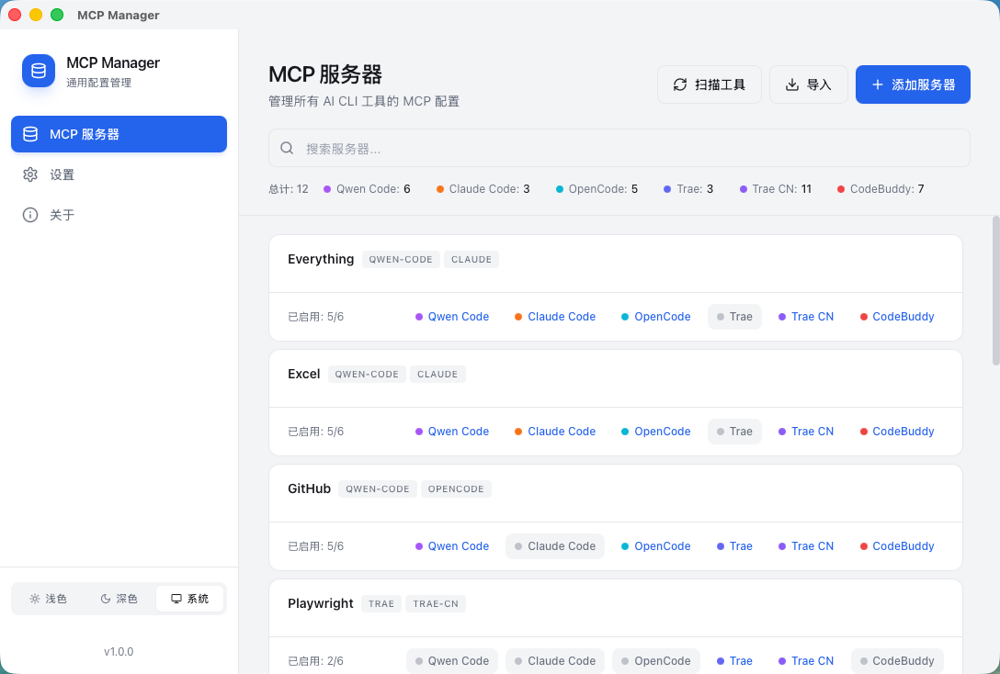

# AI Toolkit

<div align="center">

[](https://github.com)
[](https://github.com)
[](https://tauri.app/)

[中文](README.md) | [English](README_EN.md)

</div>

## 📖 Introduction

AI Toolkit is a **universal AI programming tools management tool** that supports unified MCP server configuration and Skills synchronization. Say goodbye to tedious manual editing—one app to rule them all.

## ✨ Key Features

### 🎯 MCP Server Management
- Support for **11** mainstream AI programming tools: Qwen Code, Claude Code, Codex, Gemini CLI, OpenCode, Trae, Trae CN, TRAE SOLO CN, Qoder, Qoder CLI, CodeBuddy
- Add, edit, and delete MCP servers in a single interface
- Automatically detects installed AI tools on your system and prompts for MCP sync when new tools are discovered
- Toggle switches **sync in real-time** to the corresponding tool's configuration file
- **JSON Paste Mode**: Copy JSON configuration directly from an MCP introduction page and paste to recognize
- **Connection Testing**: Built-in test connection function to ensure server configurations are valid before saving

### 🧰 Skills Management
- **Skills Panel**: Dedicated Skills management interface for centralized skill management
- **Batch Sync**: Select multiple Skills and sync to multiple target tools at once
- **Git Installation**: Install Skills from GitHub/GitLab repositories with automatic repository structure parsing
- **Online Search**: Search trending Skills from skills.sh
- **Featured Recommendations**: Browse featured Skills with install counts and star information
- **One-Click Update**: Auto-detect Skills with updates available and quick update support

### 🔧 Developer Friendly
- Click on a tool name to quickly open the corresponding configuration file
- Visual interface, goodbye manual editing of JSON/TOML files
- Automatic recognition of multiple configuration file paths
- **Atomic Writing**: Temporary file + rename mechanism to prevent configuration corruption

### 🚀 Quick Agent Launch
- **One-Click Launch**: Start AI tools directly from a terminal
- **Terminal Preference**: Choose the preferred launch terminal in Settings (macOS: Terminal / iTerm / Warp / Ghostty; Windows: Windows Terminal / PowerShell / Command Prompt)

### 📦 Tool Management
- **Installation Wizard**: Shows multiple installation methods (Homebrew, npm, curl scripts)
- **Version Detection**: Auto-detect installed tool versions
- **One-Click Update**: Quickly update installed tools

## 📸 Screenshots

### Main Panel


## 🖥️ System Support

| System | Status | Description |
|--------|--------|-------------|
| **macOS 12+** | ✅ Supported | Full feature support |
| **Linux** | 🚧 In Progress | Basic functionality available |
| **Windows 10+** | ✅ Supported | MCP, Skills, tool launching, and terminal preferences are supported |

## 🚀 Quick Start

### macOS Installation

Download the latest `AI Toolkit_x.x.x_aarch64.dmg` installer from the [Releases](https://github.com/whyfail/ai-toolkit/releases) page:

```bash
# Mount DMG
hdiutil attach AI\ Toolkit_*.dmg

# Drag to Applications folder
cp -R /Volumes/AI\ Toolkit/AI\ Toolkit.app /Applications/
```

### ⚠️ macOS Security Warning (Required for First Run)

Since the current version is not code-signed or notarized by Apple, macOS Gatekeeper may block it on first launch, showing **"Cannot be verified"** or **"File is damaged"**. Follow these steps to allow it:

**Method 1 (Terminal Command - Recommended):**
1. Drag the app to your `/Applications` folder
2. Open **Terminal** and run the following command:
   ```bash
   sudo xattr -cr "/Applications/AI Toolkit.app"
   ```
3. Enter your Mac password and press Enter (characters won't be displayed). Once the command finishes, you can double-click to open.

**Method 2 (Right-Click Open):**
1. Locate `AI Toolkit.app` in **Finder**
2. **Right-click** (or `Control + Click`) the app icon
3. Select **"Open"** from the context menu
4. Click **"Open"** again in the system warning dialog

**Method 3 (System Settings):**
1. Open **System Settings** -> **Privacy & Security**
2. Scroll down to the **Security** section
3. Find the message `"AI Toolkit" was blocked from use...`
4. Click **"Open Anyway"** and enter your password if prompted

## 📁 Supported AI Tools & Configuration Paths

| Tool | Configuration Path |
|------|-------------------|
| Qwen Code | `~/.qwen/settings.json` |
| Claude Code | `~/.claude.json` |
| OpenAI Codex | `~/.codex/config.toml` |
| Google Gemini CLI | `~/.gemini/settings.json` |
| OpenCode | `~/.config/opencode/opencode.json` |
| Qoder | `~/Library/Application Support/Qoder/SharedClientCache/mcp.json` |
| Qoder CLI | `~/.qodercli/settings.json` |
| Trae | `~/Library/Application Support/Trae/User/mcp.json` |
| Trae CN | `~/Library/Application Support/Trae CN/User/mcp.json` |
| TRAE SOLO CN | `~/Library/Application Support/TRAE SOLO CN/User/mcp.json` |
| CodeBuddy | `~/.codebuddy/mcp.json` |

## 🛠️ Tech Stack

- **Frontend**: React 18 · TypeScript · Vite · TailwindCSS · TanStack Query
- **Backend**: Tauri 2 · Rust · SQLite (rusqlite)

## 📄 License

MIT License

---

<div align="center">
  <p>Made with ❤️ for AI Developers</p>
</div>
