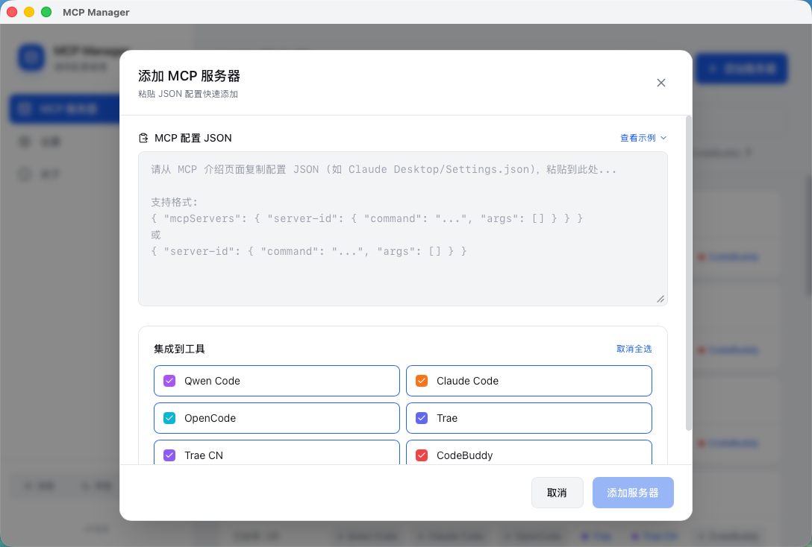
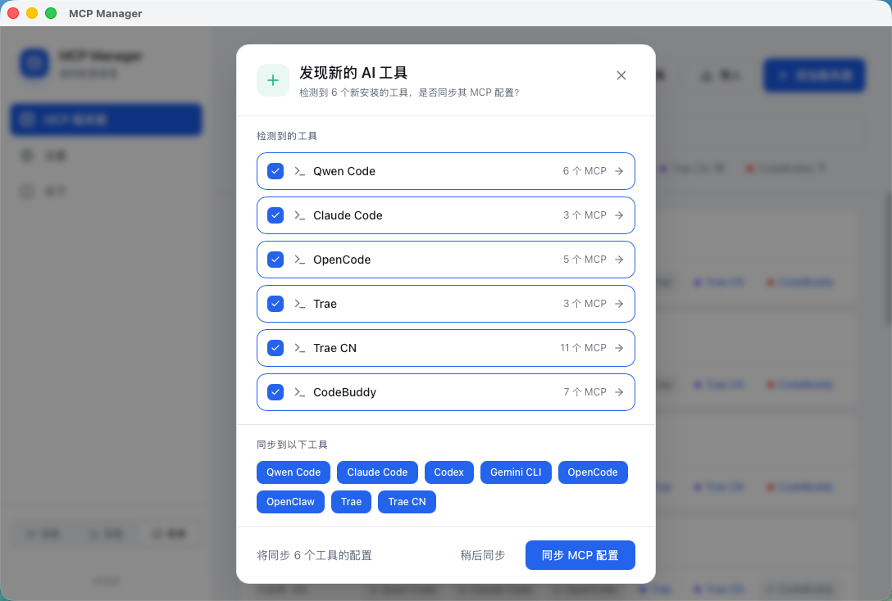

# AI Toolkit

<div align="center">

[](https://github.com)
[](https://github.com)
[](https://tauri.app/)

[中文](README.md) | [English](README_EN.md)

</div>

## 📖 Introduction

AI Toolkit is a **universal Model Context Protocol (MCP) server management tool** designed to help developers uniformly manage MCP configurations across multiple AI programming tools. Say goodbye to tedious manual editing—one app to rule them all.

## ✨ Key Features

### 🎯 Unified Management, One-Click Sync
- Support for **8** mainstream AI programming tools: Qwen Code, Claude Code, OpenAI Codex, Google Gemini CLI, OpenCode, OpenClaw, Trae, Trae CN, Qoder, CodeBuddy
- Add, edit, and delete MCP servers in a single interface
- Automatically detects installed AI tools on your system and prompts for MCP sync when new tools are discovered
- Toggle switches **sync in real-time** to the corresponding tool's configuration file

### 📋 Minimalist Configuration
- **JSON Paste Mode**: Copy JSON configuration directly from an MCP introduction page and paste to recognize
- **Smart Parsing**: Automatically extracts server ID, name, command, and arguments
- **Connection Testing**: Built-in test connection function to ensure server configurations are valid before saving
- **Atomic Writing**: Temporary file + rename mechanism to prevent configuration corruption

### 🔧 Developer Friendly
- Click on a tool name to quickly open the corresponding MCP configuration file
- Visual interface, goodbye manual editing of JSON/TOML files
- Automatic recognition of multiple configuration file paths

## 📸 Screenshots

### Main Panel
> [!NOTE]
> 
> *Unified MCP server management panel showing installed tools and their enabled status*

### Add Server
> [!NOTE]
> 
> *JSON paste mode with real-time parsing, connection testing, and target tool selection*

### Scan New Tools
> [!NOTE]
> 
> *Automatically discover newly installed AI tools and prompt for MCP sync*

## 🖥️ System Support

| System | Status | Description |
|--------|--------|-------------|
| **macOS 12+** | ✅ Supported | Full feature support |
| **Linux** | 🚧 In Progress | Basic functionality available |
| **Windows 10+** | 🚧 In Progress | Path adaptation in progress |

## 🚀 Quick Start

### macOS Installation

Download the latest `AI Toolkit_x.x.x_aarch64.dmg` installer from the [Releases](https://github.com/whyfail/ai-tool-manager/releases) page:

```bash
# Mount DMG
hdiutil attach AI\ Toolkit_*.dmg

# Drag to Applications folder
cp -R /Volumes/AI\ Toolkit/AI\ Toolkit.app /Applications/
```

### ⚠️ macOS Security Warning (Required for First Run)

Since the current version is not code-signed or notarized by Apple, macOS Gatekeeper may block it on first launch, showing **"Cannot be verified"** or **"File is damaged"**. Follow these steps to allow it:

**Method 1 (Terminal Command - Recommended for "File is Damaged" error):**
1. Drag the app to your `/Applications` folder
2. Open **Terminal** and run the following command:
   ```bash
   sudo xattr -cr "/Applications/AI Toolkit.app"
   ```
3. Enter your Mac password and press Enter (characters won't be displayed). Once the command finishes, you can double-click to open.

**Method 2 (Right-Click Open):**
1. Locate `AI Toolkit.app` in `Finder`
2. **Right-click** (or `Control + Click`) the app icon
3. Select **"Open"** from the context menu
4. Click **"Open"** again in the system warning dialog

**Method 3 (System Settings):**
1. Open **System Settings** -> **Privacy & Security**
2. Scroll down to the **Security** section
3. Find the message `"AI Toolkit" was blocked from use...`
4. Click **"Open Anyway"** and enter your password if prompted

### First Use

1. Launch AI Toolkit
2. The app will automatically scan installed AI tools
3. Click "Add Server" to paste JSON configuration
4. Click "Test Connection" to verify configuration
5. Select the AI tools to sync with, then save to apply

## 📁 Supported AI Tools & Configuration Paths

| Tool | Configuration Path |
|------|-------------------|
| Qwen Code | `~/.qwen/settings.json` |
| Claude Code | `~/.claude.json` |
| OpenAI Codex | `~/.codex/config.toml` |
| Google Gemini CLI | `~/.gemini/settings.json` |
| OpenCode | `~/.config/opencode/opencode.json` |
| OpenClaw | `~/.openclaw/openclaw.json` |
| Trae | `~/Library/Application Support/Trae/User/mcp.json` |
| Trae CN | `~/Library/Application Support/Trae CN/User/mcp.json` |
| Qoder | `~/.qoder/settings.json` |
| CodeBuddy | `~/.codebuddy/mcp.json` |

## 🛠️ Tech Stack

- **Frontend**: React 18 · TypeScript · Vite · TailwindCSS · TanStack Query
- **Backend**: Tauri 2 · Rust · SQLite (rusqlite)

## 📄 License

MIT License

---

<div align="center">
  <p>Made with ❤️ for AI Developers</p>
</div>
